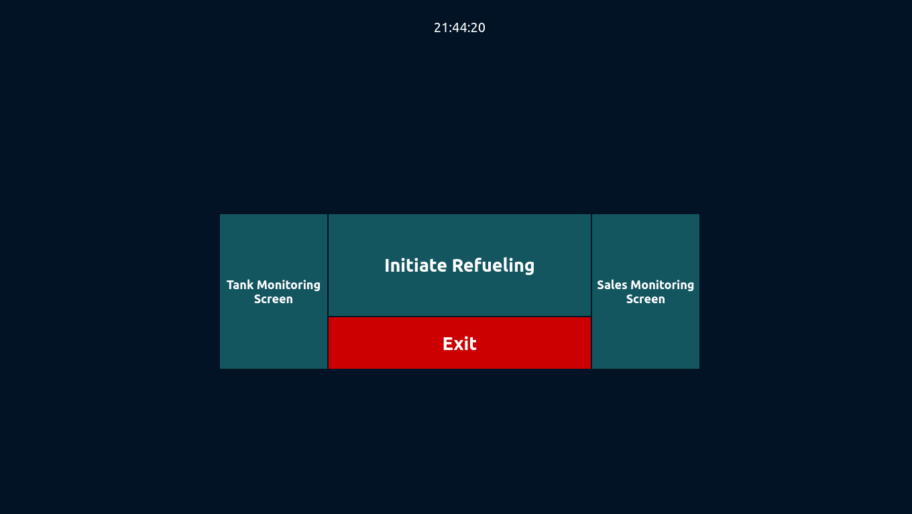
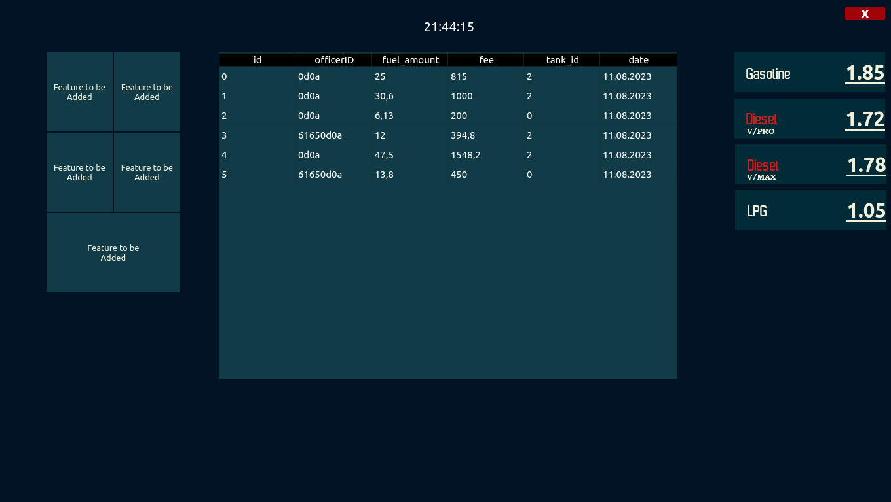
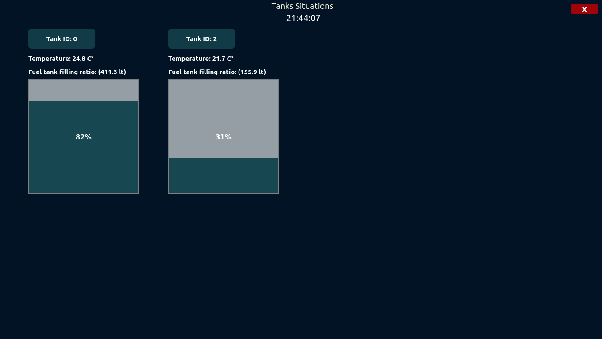
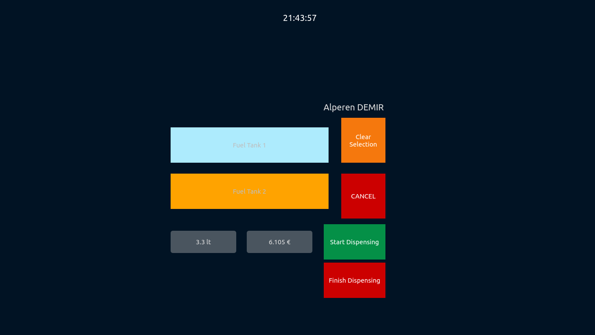

    
# RFID-Proximity-Card-Reader
> Project Overview:

Automation of Fuel Pump using Serial Port Communication on an RFID Proximity Card Reader.
Multi-threaded Automation for Simulating Fuel Dispensing in Fuel Pumps via Serial Port Communication and PostgreSQL Integration.
This project employs a multi-threaded approach to listen to a card reader through serial port communication, interpreting responses from the device, and subsequently simulating fuel dispensing operations in fuel pumps. Furthermore, it establishes communication with a PostgreSQL database to facilitate this process. In addition, the system offers the capability to continuously monitor and update the fill levels and temperatures of hypothetical fuel tanks in the simulation environment, utilizing the database for seamless data management. Moreover, the software includes a real-time sales monitoring interface, where sales transactions made at the station are consistently displayed on-screen using QTimer, ensuring a perpetually up-to-date presentation.

> ## Screenshots:
> Main page:
> |  |
> | -- |
> 
> Sale monitoring:
> |  |
> | -- |

> Fuel tank situation monitoring:
> |  |
> | -- |

> Sale page during procees:
> |  |
> | -- |

> Requirements:
##### QT 5.9.5
